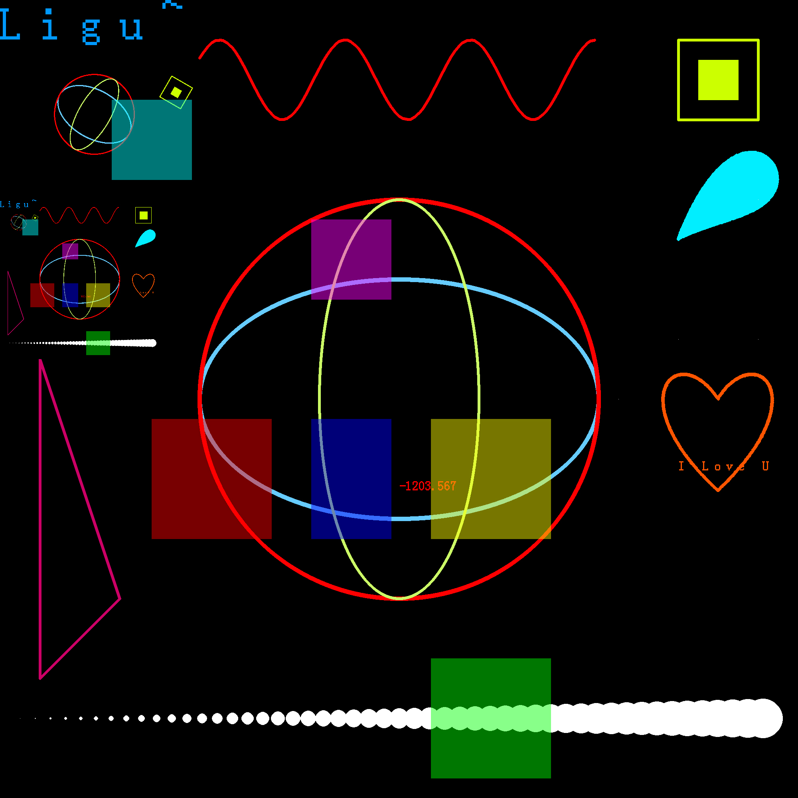
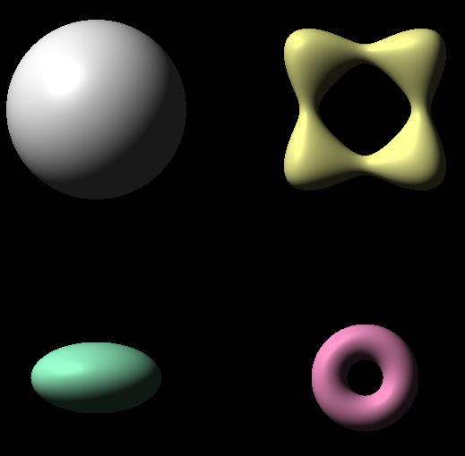
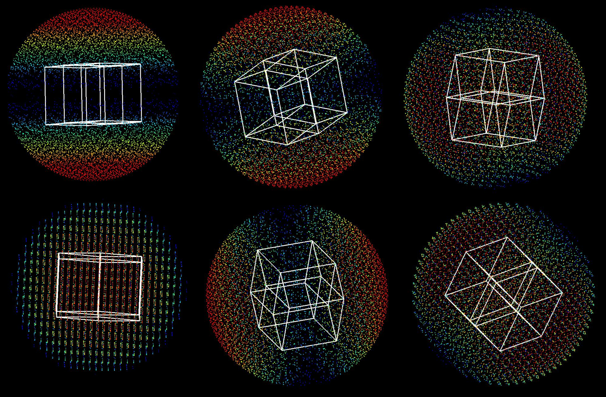
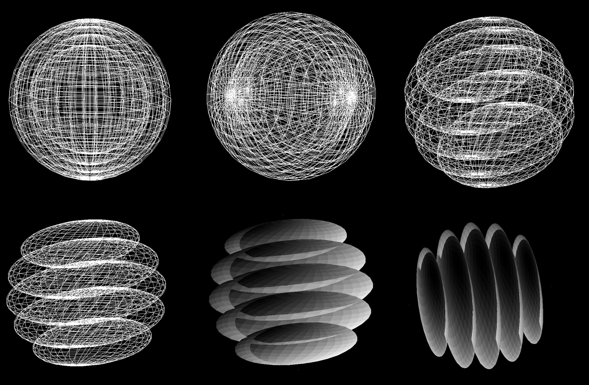
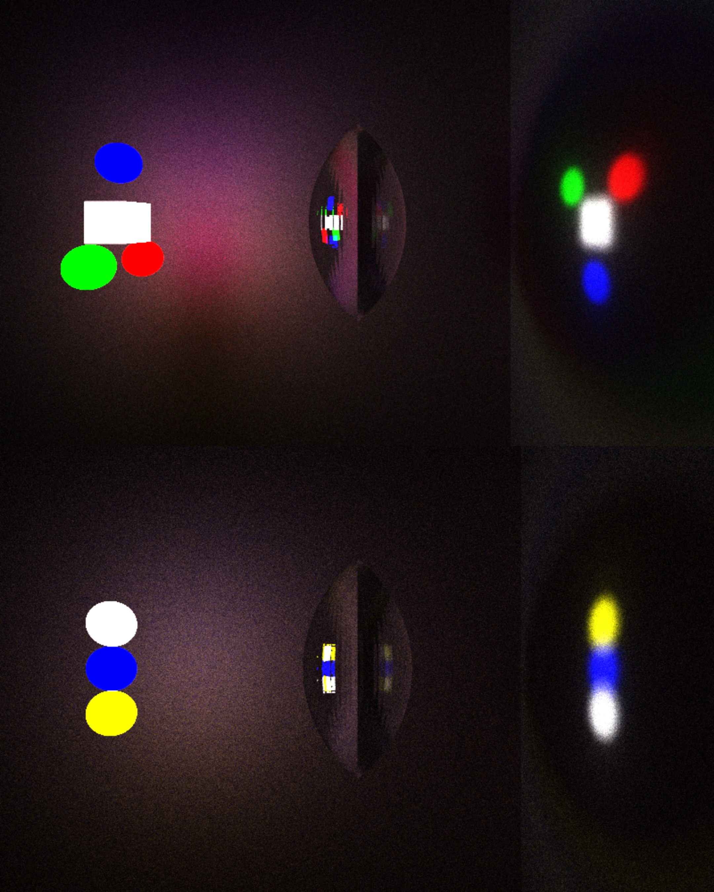
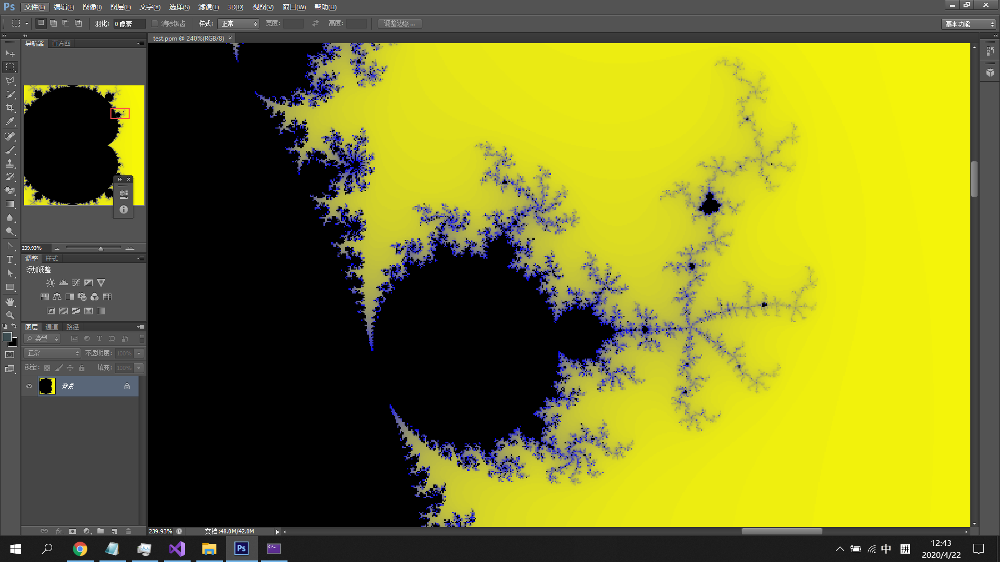

# $Graphics\ Library$ 
[TOC]

## List

* Basic
  * Files Input/Output  <[GraphicsIO.h](GraphicsIO.h)>
  * Font  <[font.h](font.h)>
* Color
  * RGB  <[RGB.h](RGB.h)>
  * HSV  <[HSV.h](HSV.h)> 
* Graphics
  * 2D Graphics  <[Graphics2D.h](Graphics2D.h)[/.cpp](Graphics2D.cpp)>
    * Basic Geometry
      * Point
      * Line
      * Triangle, Rectangle, Regular Polygon, Polygon
      * Circle, Ellipse
      * Bezier Curve
    * Tessellation
      * Grid
    * Fill
    * Text
      * Char
      * String
      * Num
  * 3D Graphics  <[Graphics3D.h](Graphics3D.h)[/.cpp](Graphics3D.cpp)>
    * Basic Geometry
      * Point
      * Line
      * Sphere
      * Body with Funtion
  * Any Dimension Graphics  <[GraphicsND.h](GraphicsND.h)[/.cpp](GraphicsND.cpp)>  
    * Point
    * Line
    * Hyper Cuboid 
    * Grid
  * Science plot  <[plot.h](plot.h)>
    * contour
  * Illumination  <[Illumination.h](Illumination.h)>
    * Phong Illumination Model
  * Geometry Transform  <[Transform.h](Transform.h)[/.cpp](Transform.cpp)>
    * Translate
    * Rotate
    * Scale
    * Reflect
* Modeling  
  <[Modeling.h](Modeling.h)[/.cpp](Modeling.cpp)> 
  * Perlin Noise  
    <[PerlinNoise.h](PerlinNoise.h)>
  * Marching Cubes  
    <[MarchingCubes.h](MarchingCubes.h)>
    - Generation of arbitrary 3D isosurface
  * Ear Cliping
    <[Ear_Cliping.h](Ear_Cliping.h)>
    - solve the triangulation of ordinary polygon
* Ray Tracing
  * Metropolis Light Transport

## API
### $Graphics2D$

 

### $Graphics3D$

### $GraphicsND$

### $Ray\ Tracing$

### $Fractal$

## Reference
1. Computer Graphics with OpenGL. Donald Hearn, M. Pauline Baker, Warren R. Carithers
2. [paper.xlsx](assets\paper.xlsx) 