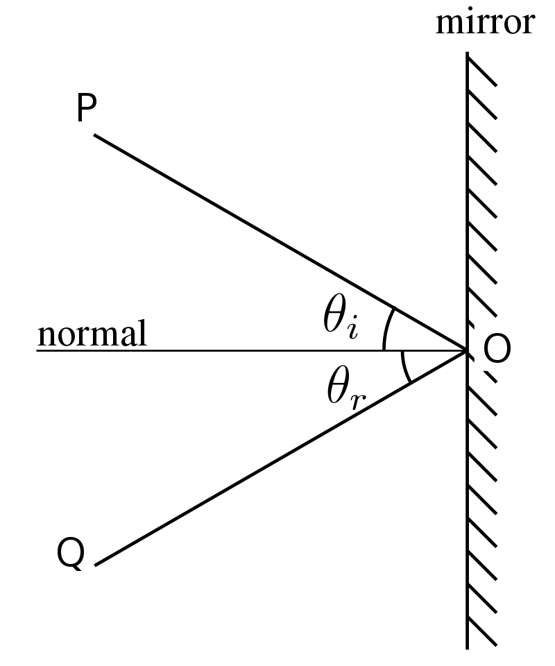
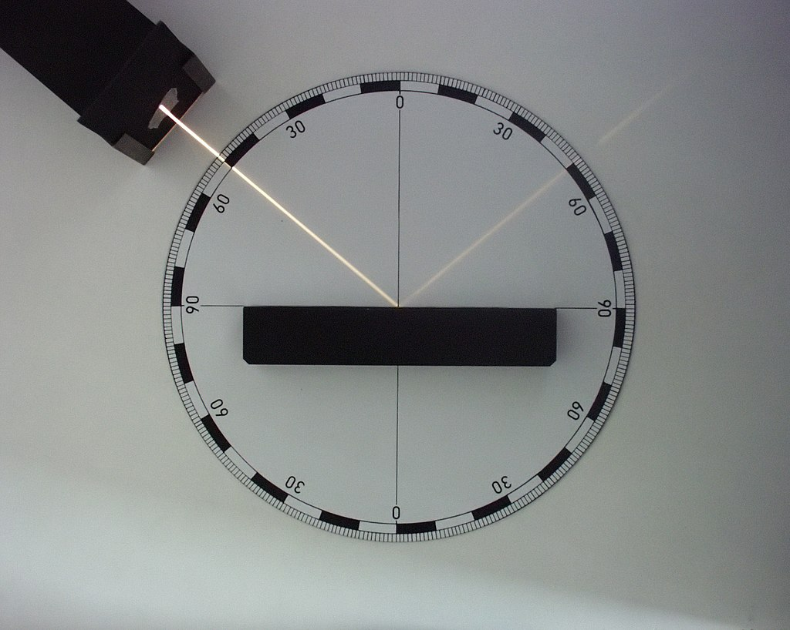
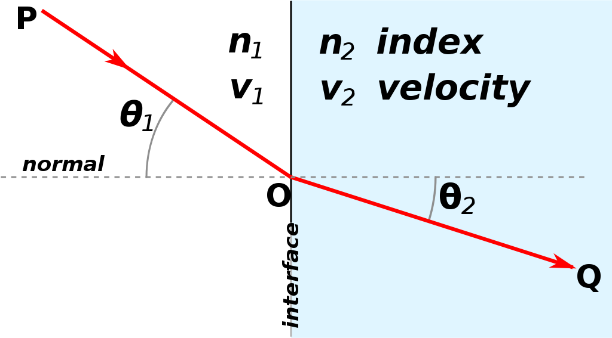
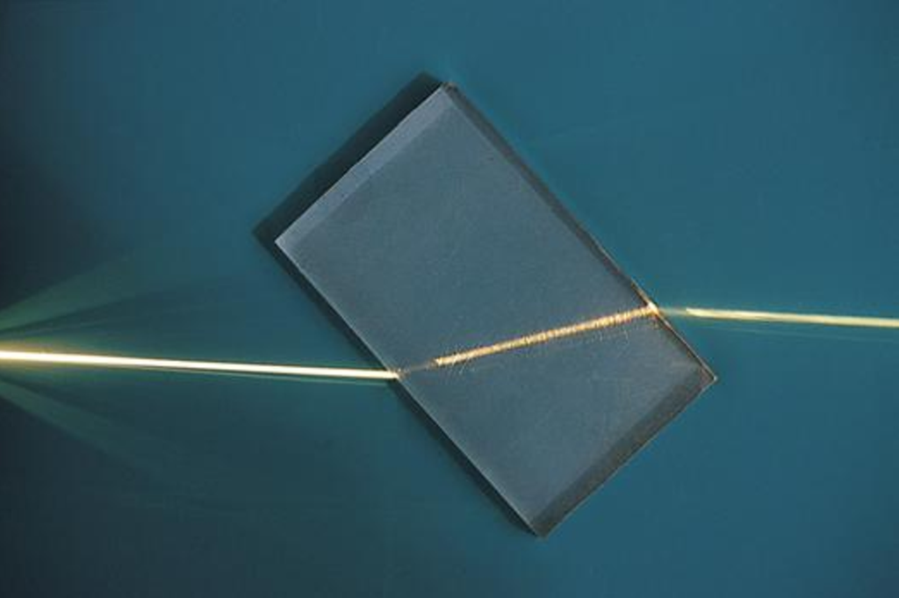
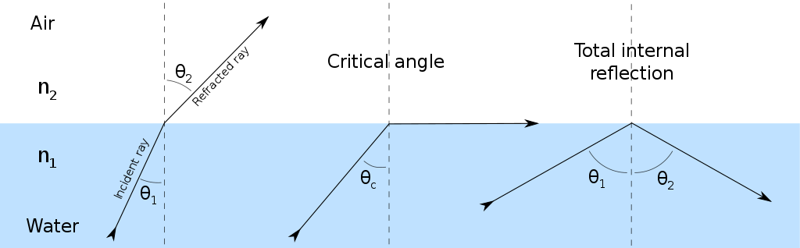

# $Geometric\ Optics$
[TOC]
# Basic Principles
- Light propagates in a straight line.
- Light paths are reversible.
- When two beams of light propagate without interference and converge at the same point, their intensities simply add up.
- Laws of light propagation at the interface between media.

# Light propagation law at the interface of the medium
## Reflection
law of reflection
$$θ_i = θ_o$$

Algorithm 反射光线 
$$\boldsymbol L_o = \boldsymbol L_i - 2 (\boldsymbol N · \boldsymbol L_i) \boldsymbol N$$
面矢$\boldsymbol N$, 入射光$L_i$, 出射光$L_o$

## Refraction
law of refraction
$$n_i·\sin θ_i = n_o·\sin θ_o$$

### Total internal reflection

### Refraction ray calculation
$$\boldsymbol L_o = \boldsymbol L_i + \boldsymbol N· (\cos θ_i - \frac{\sqrt{1 - n^2·\sin^2 θ_i}}{n})$$
面矢$\boldsymbol N$, 入射光$\boldsymbol L_i$, 出射光$L_o$, 折射率 $n = \frac{n_i}{n_o}$, 折射角$ θ_i = <\boldsymbol L, \boldsymbol N>$

- Proof  
    $$\begin{align*}
    \boldsymbol L_o 
      &= \boldsymbol L_i + \boldsymbol N·\frac{\sin(θ_o - θ_i)}{\sinθ_o}  \\
      &= \boldsymbol L_i + \boldsymbol N· \frac{\cos θ_i·\sinθ_o - \cos θ_o·\sinθ_i}{\sinθ_o}  \\
      &= \boldsymbol L_i + \boldsymbol N· (\cos θ_i - \frac{\cos θ_o}{n})  \\
      &= \boldsymbol L_i + \boldsymbol N· (\cos θ_i - \frac{\sqrt{1 - n^2·\sin^2θ_i}}{n})  \\
    \end{align*}$$

### Example
* Convex lens
  - Define
    边缘薄、中间厚的透镜. 主要对光起会聚的作用.
  - Property
    - 物距 $u > 2 F$, 像距$v \in (F, 2F)$, 倒立缩小的实像, 物像异侧.
    - 物距 $u = 2 F$, 像距$v = 2 F$, 倒立等大的实像, 物像异侧.
    - 物距 $u \in (F, 2F)$, 像距$v > 2 F$, 倒立放大的实像, 物像异侧.
    - 物距 $u = F$, 不成像.
    - 物距 $u < f$, 像距$v > F$, 正立放大的虚像, 物像同侧.
* Concave lens

## Diffuse Reflection

在面矢半球内, 面积均匀的随机取一射线, 作为反射光线.

# Fog  
## Fog model
$$L_o(x) = L_i(x) · t(x) + A · (1 - t(x))$$
$L_o(x)$ 观测到的亮度, $L_i(x)$ 原始无雾时亮度, $t(x)$ 透射率, $A$大气光亮度. 

当大气密度、成分是均匀同质时, 透射率 $t(x) = e^{-\beta d(x)}$

# [Illumination Model](./Illumination_Model.md)

